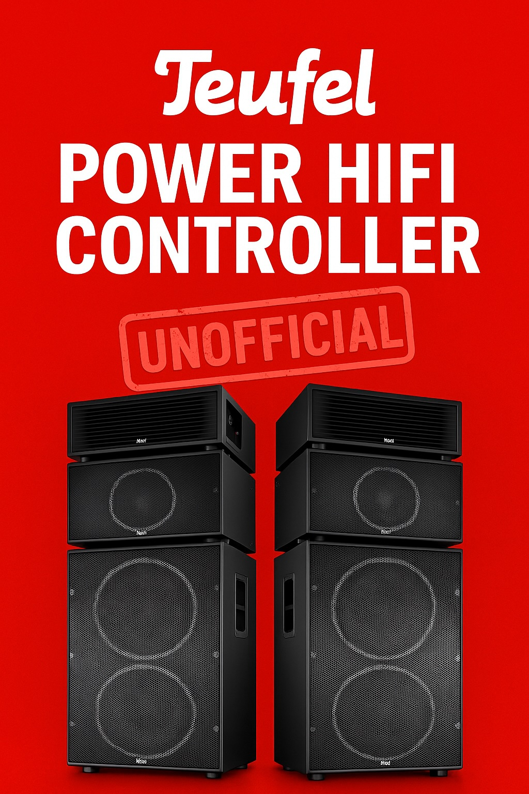

# Teufel Power HiFi IR Controller

<div align="center">
  
</div>

🔊 Arduino, Raspberry Pi und Web-Interface Infrarot-Fernbedienung für Teufel Power HiFi Systeme

## Preview

<div align="center">
  
  <br><br>
  
  <p><em>Moderne Web-Interface mit Dark Theme und Touch-optimierten Buttons</em></p>
</div>

## Übersicht

Dieses Projekt ermöglicht die Infrarot-Fernsteuerung von Teufel Power HiFi Systemen mit Arduino, Raspberry Pi und einem modernen Web-Interface. Es implementiert das NEC Protocol mit korrektem Timing und Frame-Struktur für zuverlässige Kommunikation und bietet eine benutzerfreundliche Web-Oberfläche mit erweiterten Funktionen.

## Features

### Hardware Controller
- ✅ Vollständiger IR Command Set (Power, Volume, EQ, Inputs)
- ✅ Arduino Implementierung mit IRremote Library
- ✅ Raspberry Pi Implementierung mit Hardware PWM
- ✅ Interaktive Befehlsoberfläche
- ✅ Signal-Verifikation und Test-Tools

### Web-Interface
- ✅ Moderne responsive Web-Oberfläche
- ✅ Dark Theme Design mit Touch-optimierten Buttons
- ✅ Lautstärke-Rate-Limiting (max. 20 Schritte in 10s mit 30s Cooldown)
- ✅ Lustige Cooldown-Warnungen und visuelles Feedback
- ✅ Echtzeit-Countdown bei Cooldown-Aktivierung
- ✅ Vollständige Kontrolle über alle HiFi-Funktionen
- ✅ PWA-Unterstützung für mobile Geräte

## Hardware Anforderungen

### Arduino Setup
- Arduino Uno/Nano
- VS1838B IR Receiver
- IR LED (940nm)
- Optional: 2N2222 Transistor für erweiterte Reichweite

### Raspberry Pi Setup
- Raspberry Pi (beliebiges Modell mit GPIO)
- IR LED angeschlossen an GPIO 12 (Pin 32) - Hardware PWM erforderlich
- 220Ω Widerstand in Serie zur IR LED
- pigpio Library für Hardware PWM

## Schnellstart

### Web-Interface (Empfohlen)
```bash
# Node.js Abhängigkeiten installieren
npm install

# pigpio daemon starten
sudo pigpiod

# Web-Server starten
npm start
# oder mit PM2 für Produktion:
npm run pm2:start

# Browser öffnen: http://localhost:5002
# oder von anderem Gerät: http://[raspberry-pi-ip]:5002
# Das Web-Interface ruft automatisch das Python-Script mit sudo auf
```

### PM2 Management (Produktion)
```bash
# App mit PM2 starten
npm run pm2:start

# Status anzeigen
npm run pm2:status

# App neu starten
npm run pm2:restart

# App stoppen
npm run pm2:stop

# Logs anzeigen
npm run pm2:logs

# PM2 Setup für Auto-Start nach Reboot
npm run pm2:setup
```

### Arduino
```bash
# IRremote Library (Version 4.x) in Arduino IDE installieren
# teufel-power-hifi-ir-tx.ino auf Arduino flashen
# Serial Monitor bei 9600 Baud öffnen
# Befehle verwenden: p=power, m=mute, +=volume up, etc.
```

### Raspberry Pi (Python - Command Line)
```bash
# pigpio installieren
sudo apt-get install pigpio python3-pigpio

# pigpio daemon starten
sudo pigpiod

# Wrapper-Script verwenden (empfohlen)
./teufel-controller --interactive
./teufel-controller --command CMD_POWER
./teufel-controller --list

# Oder direkt Python-Script
sudo python3 teufel-power-hifi-controller.py --interactive
sudo python3 teufel-power-hifi-controller.py --command CMD_POWER
sudo python3 teufel-power-hifi-controller.py --command CMD_VOLUME_UP --repeats 3

# Verfügbare Befehle anzeigen
python3 teufel-power-hifi-controller.py --list
```

## Befehlsreferenz

| Funktion | Code | Taste |
|----------|------|-------|
| Power | 0x48 | p |
| Mute | 0x28 | m |
| Bluetooth | 0x40 | l |
| Volume Up | 0xB0 | + |
| Volume Down | 0x30 | - |
| Bass Up/Down | 0x58/0x41 | B/b |
| Mid Up/Down | 0x68/0x42 | M/n |
| Treble Up/Down | 0xB8/0x43 | T/t |
| AUX | 0x44 | 1 |
| Line | 0x45 | 2 |
| Optical | 0x3F | 3 |
| USB | 0xDF | 4 |

## Technische Details

- **Protocol**: NEC
- **Address**: 0x5780 (16-bit)
- **Carrier**: 38kHz
- **Frame**: LSB first transmission

## Projektstruktur

```
├── server.js                          # Node.js Web-Server
├── teufel-power-hifi-controller.py    # Raspberry Pi Python Controller
├── teufel-controller                  # Wrapper-Script für einfache Nutzung
├── package.json                       # Node.js Dependencies
├── ecosystem.config.js                # PM2 Konfiguration
├── controller-config.json             # Konfigurationsdatei für Server
├── public/
│   ├── index.html                     # Web-Interface (Responsive PWA)
│   ├── manifest.json                  # PWA Manifest
│   └── *.png                          # App Icons
├── reverse-engineering/
│   ├── teufel-power-hifi-ir-tx.ino   # Arduino Transmitter
│   ├── teufel-power-hifi-ir-rx.ino   # Arduino Receiver
│   ├── teufel-power-hifi-ir-rx-ts.ino # Kombiniertes Test-Tool
│   └── teufel-power-hifi-ir-mapping.csv # IR Code Mapping
├── logs/                              # Anwendungs-Logs
├── CLAUDE.md                          # Entwicklungshandbuch
└── README.md                          # Diese Datei
```

## Web-Interface Features

### Benutzeroberfläche
- **Dark Theme**: Moderne, augenfreundliche Benutzeroberfläche
- **Responsive Design**: Optimiert für Desktop, Tablet und Smartphone
- **Touch-optimiert**: Große Buttons für einfache Bedienung auf mobilen Geräten
- **PWA-Support**: Kann als App auf dem Homescreen installiert werden

### Erweiterte Funktionen
- **Volume Rate Limiting**: Verhindert übermäßige Lautstärke-Erhöhung
  - Maximal 20 Lautstärke-Schritte in 10 Sekunden
  - 30 Sekunden Cooldown bei Überschreitung
  - Lustiger Toast mit Warnung: "🎵 Cooldown aktiviert! Wir wollen es nicht übertreiben! 😄"
  - Live-Countdown im Button während Cooldown
- **Toast-Nachrichten**: Bestätigung aller Aktionen mit visueller Rückmeldung
- **Button-States**: Visuelle Rückmeldung bei Aktionen (Hover, Active, Disabled)

### Technische Details
- **Node.js Backend**: Express.js Server mit API-Endpunkten
- **Python Integration**: Automatischer Aufruf des Python-Scripts via Command-Line
- **Sudo-Berechtigung**: Web-Server führt Python-Script mit sudo für GPIO-Zugriff aus
- **Vanilla JavaScript**: Keine externen Frameworks für maximale Performance
- **CSS Custom Properties**: Konsistentes Design-System
- **Hardware PWM Integration**: pigpio Library für präzise IR-Übertragung
- **PM2 Process Manager**: Produktionsreifes Process Management mit Auto-Restart
- **Systemd Integration**: Automatischer Start nach Reboot via PM2 Startup Script

## Schaltpläne

### Arduino IR Transmitter
```
Arduino Pin 3 ──── IR LED (+)
GND ──────────────── IR LED (-)
```

### Raspberry Pi IR Transmitter
```
GPIO 12 (Pin 32) ── 220Ω Widerstand ── IR LED (+)
GND ──────────────────────────────────── IR LED (-)
```

## Fehlerbehebung

### Hardware
- **Keine Reaktion**: LED-Polarität und Abstand prüfen (10-20cm)
- **Schwaches Signal**: 2N2222 Transistor-Verstärker hinzufügen
- **Falsche Codes**: NEC Protocol und Address 0x5780 verifizieren

### Web-Interface
- **Web-Interface lädt nicht**: pigpio daemon prüfen: `sudo pigpiod`
- **Buttons funktionieren nicht**: Node.js Server benötigt sudo-Berechtigung für Python-Script
- **Permission Denied**: Raspberry Pi User muss sudo-Berechtigung haben
- **Python-Script Fehler**: `python3 teufel-power-hifi-controller.py --list` zum Testen
- **"Befehl fehlgeschlagen"**: Pfad in `controller-config.json` prüfen
- **Externe Zugriffe**: Server läuft auf `0.0.0.0:5002` - von anderen Geräten per IP erreichbar

### PM2 Management
- **PM2 Status prüfen**: `npm run pm2:status`
- **Logs anzeigen**: `npm run pm2:logs`
- **Nach Reboot nicht gestartet**: `pm2 save` nach Änderungen ausführen
- **Service nicht gefunden**: PM2 Setup wiederholen: `npm run pm2:setup`

### Command-Line
```bash
# Test ob pigpio läuft
sudo python3 teufel-power-hifi-controller.py --command CMD_POWER

# Wrapper-Script verwenden
./teufel-controller --command CMD_POWER
./teufel-controller --list

# Verfügbare Befehle anzeigen
python3 teufel-power-hifi-controller.py --list

# Hilfe anzeigen
python3 teufel-power-hifi-controller.py --help
```

## Lizenz

MIT License

Copyright (c) 2025 Martin Pfeffer, Berlin

Permission is hereby granted, free of charge, to any person obtaining a copy
of this software and associated documentation files (the "Software"), to deal
in the Software without restriction, including without limitation the rights
to use, copy, modify, merge, publish, distribute, sublicense, and/or sell
copies of the Software, and to permit persons to whom the Software is
furnished to do so, subject to the following conditions:

The above copyright notice and this permission notice shall be included in all
copies or substantial portions of the Software.

THE SOFTWARE IS PROVIDED "AS IS", WITHOUT WARRANTY OF ANY KIND, EXPRESS OR
IMPLIED, INCLUDING BUT NOT LIMITED TO THE WARRANTIES OF MERCHANTABILITY,
FITNESS FOR A PARTICULAR PURPOSE AND NONINFRINGEMENT. IN NO EVENT SHALL THE
AUTHORS OR COPYRIGHT HOLDERS BE LIABLE FOR ANY CLAIM, DAMAGES OR OTHER
LIABILITY, WHETHER IN AN ACTION OF CONTRACT, TORT OR OTHERWISE, ARISING FROM,
OUT OF OR IN CONNECTION WITH THE SOFTWARE OR THE USE OR OTHER DEALINGS IN THE
SOFTWARE.

## 🙏 Danksagung

- IRremote Library von Arduino-IRremote
- Teufel für die großartige Power HiFi Anlage
- Arduino Community für die Unterstützung

## Mitwirkung

Issues und Pull Requests für Verbesserungen sind willkommen!

