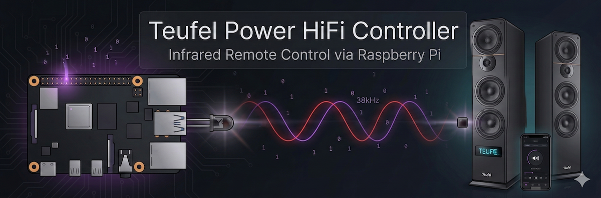

# Teufel Power HiFi Controller

<div align="center">




**Complete IR remote control solution for Teufel Power HiFi systems**  
Web interface, REST API, hardware PWM, and Arduino reverse-engineering tools

<br>

<a href="https://www.paypal.com/donate/?business=martinpaush@gmail.com&currency_code=EUR">
  
</a>

</div>

## Overview

This project provides comprehensive infrared (IR) remote control for Teufel Power HiFi systems through multiple platforms and interfaces. Originally reverse-engineered from the official remote control, it now offers web-based control, REST API, command-line tools, and Arduino implementation.

### Key Features

- **🌐 Web Dashboard** — Modern responsive interface for all HiFi controls
- **🔌 REST API** — Programmatic control for home automation integration
- **📡 Hardware PWM** — Precise 38kHz carrier using Raspberry Pi GPIO12
- **🔬 Reverse Engineering** — Complete Arduino-based IR analysis tools
- **🎛️ Full Control** — Power, volume, mute, bass, treble, balance, input selection
- **📱 Mobile Ready** — Touch-optimized interface for phones and tablets
- **🚀 Production Ready** — PM2 process management with auto-restart

## 🔁 Two IR Back-Ends — pigpio vs. Arduino Nano Serial Bridge

This controller supports **two interchangeable ways** of putting the 38 kHz NEC carrier on the IR LED. The Node.js server, the REST API and the web dashboard are **identical** for both — only the low-level **IR back-end** differs, so you can switch without touching the smart-home integration.

| | **A) pigpio (GPIO 12)** | **B) Arduino Nano Serial Bridge** ✅ *recommended* |
|---|---|---|
| Carrier source | Raspberry Pi `pigpiod` DMA wave / hardware PWM | Arduino `IRremote` hardware timer |
| Emitter pin | Pi **GPIO 12** (pin 32) | Nano **D3** |
| Reliability | Sensitive to the Pi's PWM peripheral | **Rock-solid**, independent of the Pi |
| Driver | `teufel-power-hifi-controller.py` (kept as fallback) | `ir_bridge.py` + `arduino/teufel-ir-serial-bridge/` |

> ### 💡 Why the Arduino Nano back-end exists
> On the maintainer's Raspberry Pi 3 the **onboard audio driver** (`snd_bcm2835`, enabled by `dtparam=audio=on`) claims the **same PWM hardware** that `pigpio` uses to clock the IR carrier. Symptom: the IR LED visibly lights up (a phone camera sees it) but the carrier is shredded into *thousands* of stray pulses, so the Teufel never decodes a clean NEC frame.
>
> This was proven with a second Arduino acting as an **IR receiver/analyzer**: the original Teufel remote decoded cleanly as `NEC Address=0x5780 Command=0x48`, while the pigpio output decoded as `Protocol=UNKNOWN` (a single ~5 ms blob). Re-generating the carrier on an **Arduino Nano running IRremote** produces a bit-identical, perfectly-timed signal — literally `IrSender.sendNEC(0x5780, …)` — and the speaker responds reliably across the room.

### Architecture (Nano bridge)

```
Smart-Home Dashboard ──HTTP──> nginx /proxy/hifi/ ──> Node server.js (:5002)
        │
        └─ executeCommand() ──TCP 127.0.0.1:8799──> ir_bridge.py  (systemd service)
                                                          │  keeps /dev/teufel-nano open
                                                          └─USB serial 115200─> Arduino Nano
                                                                                    │  IRremote
                                                                                    └─D3─> IR LED ──))) Teufel
```

* **`arduino/teufel-ir-serial-bridge/`** — Nano sketch. Reads one HEX command code per line and emits `IrSender.sendNEC(0x5780, code)`.
* **`ir_bridge.py`** — persistent Python daemon (`teufel-ir-bridge.service`). Holds the serial port open so there is **no per-command Arduino reset** (no ~2 s delay), maps `CMD_*` names → HEX codes and listens on `127.0.0.1:8799`.
* **`server.js`** — `executeCommand()` sends `CMD_… [repeats]` to the bridge over TCP. The REST API and dashboard are unchanged.
* **udev** — `udev/99-teufel-nano.rules` gives the Nano a stable `/dev/teufel-nano` symlink that survives USB re-enumeration.

### Hardware (Nano bridge)

| Nano pin | Connects to |
|---|---|
| **D3** | IR-LED signal (via current-limiting resistor, or a transistor driver for more range) |
| **GND** | IR-LED cathode / emitter-module GND |
| **5V** | IR transmitter module VCC (only for amplified modules) |
| **USB** | Raspberry Pi (power **and** serial) |

> ⚠️ **Use a bare 940 nm IR LED** (e.g. **KY-005**). Avoid integrated "smart" emitter units that **filter/smooth** the modulation (some M5Stack-style modules add a capacitor): they turn the clean 38 kHz carrier into a DC-ish blob that no receiver can decode.

### Setup (Nano bridge)

```bash
# 1) Flash the Nano (from the Pi via arduino-cli) — IR LED on D3
arduino-cli core install arduino:avr
arduino-cli lib install IRremote
arduino-cli compile --fqbn arduino:avr:nano:cpu=atmega328old arduino/teufel-ir-serial-bridge
arduino-cli upload  -p /dev/teufel-nano --fqbn arduino:avr:nano:cpu=atmega328old arduino/teufel-ir-serial-bridge

# 2) Install the udev rule + the bridge daemon
sudo cp udev/99-teufel-nano.rules /etc/udev/rules.d/
sudo udevadm control --reload-rules && sudo udevadm trigger
sudo cp systemd/teufel-ir-bridge.service /etc/systemd/system/
sudo systemctl daemon-reload && sudo systemctl enable --now teufel-ir-bridge

# 3) The Node service talks to the bridge automatically (127.0.0.1:8799)
sudo systemctl restart powerhifi-controller
```

### Bridge protocol & manual test

The bridge speaks a trivial line protocol on `127.0.0.1:8799` — `CMD_NAME [repeats]` → `OK`:

```bash
python3 - <<PYEOF
import socket
s = socket.create_connection(("127.0.0.1", 8799), timeout=5)
s.sendall(b"CMD_VOLUME_DOWN 3\n")   # 3 steps down
print(s.recv(64).decode().strip())  # -> OK
PYEOF
```

Supported `CMD_*` names: `CMD_POWER`, `CMD_MUTE`, `CMD_BLUETOOTH`, `CMD_VOLUME_UP`, `CMD_VOLUME_DOWN`, `CMD_LEFT`, `CMD_RIGHT`, `CMD_BASS_UP/DOWN`, `CMD_MID_UP/DOWN`, `CMD_TREBLE_UP/DOWN`, `CMD_AUX`, `CMD_LINE`, `CMD_OPT`, `CMD_USB`, `CMD_BAL_LEFT/RIGHT`.

## Quick Start

### Raspberry Pi Web Interface

```bash
# Clone the repository
git clone https://github.com/pepperonas/teufel-power-hifi-controller.git
cd teufel-power-hifi-controller

# Install dependencies
npm install

# Start the web server
npm start

# Access the interface
# http://localhost:5002 or http://[pi-ip]:5002
```

### Command Line Control

```bash
# Direct Python execution
python3 teufel-power-hifi-controller.py --command CMD_POWER

# With pigpio daemon for best performance
sudo pigpiod
sudo python3 teufel-power-hifi-controller.py --command CMD_VOL_UP
```

## Hardware Setup

### Raspberry Pi Wiring

```
    Raspberry Pi                         IR Transmitter Circuit
    ┌──────────────┐
    │              │                     ┌──[47Ω]──[IR LED]──┐
    │   3.3V  (1) ─┼─────────────────────┘                    │ C
    │              │                                       ┌──┴──┐
    │  GPIO12(32) ─┼──────────[1kΩ]─────────────────── B ──┤ NPN │
    │   (HW PWM)   │                                       └──┬──┘
    │              │                                          │ E
    │   GND  (34) ─┼──────────────────────────────────────────┘
    │              │
    └──────────────┘

    Components:
    • IR LED: 940nm wavelength
    • NPN Transistor: 2N2222 or equivalent
    • Resistors: 47Ω (current limiting), 1kΩ (base)
```

| Pi Pin | GPIO    | Connection                        |
|--------|---------|-----------------------------------|
| Pin 1  | 3.3V    | IR LED anode (via 47Ω resistor)  |
| Pin 32 | GPIO 12 | NPN base (via 1kΩ resistor)      |
| Pin 34 | GND     | NPN emitter                      |

> **Important:** GPIO 12 is required for hardware PWM to generate the precise 38kHz carrier frequency

### Arduino Wiring (for reverse engineering)

```
VS1838B IR Receiver        Arduino
-------------------        -------
OUT (Pin 1)        →       Pin D2
GND (Pin 2)        →       GND  
VCC (Pin 3)        →       5V

IR LED Transmitter         Arduino
------------------         -------
Anode (+)          →       Pin D3
Cathode (-)        →       GND
```

## IR Protocol Specifications

- **Protocol:** NEC (38kHz carrier, 33% duty cycle)
- **Address:** `0x5780` (16-bit)
- **Frame Structure:** LSB first transmission
  - Address_Low | Address_High | Command | ~Command
- **Timing:** 
  - Leader: 9ms pulse + 4.5ms space
  - Bit 0: 562.5µs pulse + 562.5µs space
  - Bit 1: 562.5µs pulse + 1687.5µs space

## Command Reference

### Complete IR Code Mapping

| Function      | Hex Code | Command Key | API Endpoint        | Description              |
|---------------|----------|-------------|---------------------|--------------------------|
| **Power**     | `0x48`   | `CMD_POWER` | `POST /api/power`   | Toggle power on/off      |
| **Mute**      | `0x28`   | `CMD_MUTE`  | `POST /api/mute`    | Toggle mute              |
| **Bluetooth** | `0x40`   | `CMD_BT`    | `POST /api/bluetooth`| Select Bluetooth input   |
| **Volume Up** | `0xB0`   | `CMD_VOL_UP`| `POST /api/volume`  | Increase volume          |
| **Volume Down**| `0x30`  | `CMD_VOL_DOWN`| `POST /api/volume`| Decrease volume          |
| **Bass Up**   | `0x58`   | `CMD_BASS_UP`| -                  | Increase bass            |
| **Bass Down** | `0x41`   | `CMD_BASS_DOWN`| -                | Decrease bass            |
| **Mid Up**    | `0x68`   | `CMD_MID_UP` | -                  | Increase midrange        |
| **Mid Down**  | `0x42`   | `CMD_MID_DOWN`| -                 | Decrease midrange        |
| **Treble Up** | `0xB8`   | `CMD_TREBLE_UP`| -                | Increase treble          |
| **Treble Down**| `0x43`  | `CMD_TREBLE_DOWN`| -              | Decrease treble          |
| **AUX**       | `0x44`   | `CMD_AUX`   | `POST /api/input`   | Select AUX input         |
| **Line**      | `0x45`   | `CMD_LINE`  | `POST /api/input`   | Select Line input        |
| **Optical**   | `0x3F`   | `CMD_OPT`   | `POST /api/input`   | Select Optical input     |
| **USB**       | `0xDF`   | `CMD_USB`   | `POST /api/input`   | Select USB input         |
| **Balance L** | `0xBF`   | `CMD_BAL_L` | -                   | Shift balance left       |
| **Balance R** | `0x5F`   | `CMD_BAL_R` | -                   | Shift balance right      |
| **Left**      | `0x78`   | `CMD_LEFT`  | -                   | Navigation left          |
| **Right**     | `0xF8`   | `CMD_RIGHT` | -                   | Navigation right         |

## API Documentation

### REST Endpoints

| Endpoint | Method | Body | Description | Response |
|----------|--------|------|-------------|----------|
| `/api/health` | GET | - | Health check | `{ "status": "ok", "timestamp": ... }` |
| `/api/status` | GET | - | Current device status | `{ "power": true, "volume": 50, ... }` |
| `/api/power` | POST | - | Toggle power on/off | `{ "success": true, "state": "on" }` |
| `/api/volume` | POST | `{ "action": "up\|down" }` | Adjust volume | `{ "success": true, "action": "up" }` |
| `/api/mute` | POST | - | Toggle mute | `{ "success": true, "muted": true }` |
| `/api/input` | POST | `{ "input": "AUX\|LINE\|OPTICAL\|USB\|BLUETOOTH" }` | Select input | `{ "success": true, "currentInput": "AUX" }` |

### Python CLI Arguments

```bash
python3 teufel-power-hifi-controller.py --command [COMMAND]

Commands:
  CMD_POWER     Toggle power
  CMD_MUTE      Toggle mute
  CMD_VOL_UP    Volume up
  CMD_VOL_DOWN  Volume down
  CMD_BASS_UP   Bass up
  CMD_BASS_DOWN Bass down
  CMD_BT        Bluetooth input
  CMD_AUX       AUX input
  CMD_LINE      Line input
  CMD_OPT       Optical input
  CMD_USB       USB input
```

## Reverse Engineering Tools

The `reverse-engineering/` directory contains Arduino sketches for analyzing and replicating IR signals:

### 1. IR Receiver (`teufel-power-hifi-ir-rx.ino`)
Captures and decodes IR signals from the original remote:

```bash
# Upload to Arduino, open Serial Monitor (9600 baud)
# Point original remote at VS1838B sensor
# Output: NEC | 0x5780 | 0x48 | Power
```

### 2. IR Transmitter (`teufel-power-hifi-ir-tx.ino`)
Sends IR commands to the HiFi system:

```bash
# Serial commands:
p = Power
m = Mute
+ = Volume Up
- = Volume Down
1 = AUX
2 = Line
3 = Optical
4 = USB
```

### 3. IR Transceiver (`teufel-power-hifi-ir-rx-ts.ino`)
Combined sender/receiver for testing and verification:

```bash
# Modes:
t = Test mode (verify transmission)
r = Read only mode
A = Auto-test all commands
```

## Installation & Configuration

### Prerequisites

**Raspberry Pi:**
- Raspbian OS (Bullseye or newer)
- Node.js 18+ 
- Python 3.9+
- pigpio library (optional but recommended)

**Arduino:**
- Arduino IDE 1.8+ or 2.x
- IRremote library 4.x

### Detailed Setup

1. **Install system dependencies:**
```bash
# Update system
sudo apt update && sudo apt upgrade -y

# Install Node.js (if not present)
curl -fsSL https://deb.nodesource.com/setup_18.x | sudo -E bash -
sudo apt install -y nodejs

# Install pigpio (optional, for better performance)
sudo apt install pigpio python3-pigpio
```

2. **Clone and configure:**
```bash
git clone https://github.com/pepperonas/teufel-power-hifi-controller.git
cd teufel-power-hifi-controller
npm install
```

3. **Configure the controller:**
```bash
# Edit controller-config.json if needed
nano controller-config.json
```

4. **Set up as system service (optional):**
```bash
# Using PM2
npm install -g pm2
pm2 start ecosystem.config.js
pm2 save
pm2 startup

# Or using systemd
sudo cp teufel-controller.service /etc/systemd/system/
sudo systemctl enable teufel-controller
sudo systemctl start teufel-controller
```

## Project Structure

```
teufel-power-hifi-controller/
├── teufel-power-hifi-controller.py   # Main Python IR controller
├── server.js                          # Express web server
├── controller-config.json             # Configuration file
├── ecosystem.config.js                # PM2 configuration
├── public/                           # Web interface assets
│   ├── index.html                    # Dashboard UI
│   ├── style.css                     # Styling
│   └── script.js                     # Client-side logic
├── reverse-engineering/              # Arduino IR tools
│   ├── teufel-power-hifi-ir-rx.ino  # IR receiver/scanner
│   ├── teufel-power-hifi-ir-tx.ino  # IR transmitter
│   ├── teufel-power-hifi-ir-rx-ts.ino # Combined tester
│   ├── teufel-power-hifi-ir-mapping.csv # Command mapping
│   └── README.md                     # Arduino documentation
└── logs/                             # Application logs
```

## Advanced Usage

### Home Automation Integration

#### Home Assistant
```yaml
# configuration.yaml
switch:
  - platform: rest
    name: Teufel HiFi Power
    resource: http://[pi-ip]:5002/api/power
    method: POST
    
input_select:
  teufel_input:
    name: Teufel Input Source
    options:
      - AUX
      - Line
      - Optical
      - USB
      - Bluetooth
```

#### Node-RED
```json
{
  "id": "teufel-volume-up",
  "type": "http request",
  "url": "http://[pi-ip]:5002/api/volume",
  "method": "POST",
  "payload": {"action": "up"}
}
```

#### OpenHAB
```java
Thing http:url:teufel "Teufel HiFi" [
    baseURL="http://[pi-ip]:5002/api",
    refresh=30
]
```

### Custom Integration

```javascript
// JavaScript/Node.js
const fetch = require('node-fetch');

async function togglePower() {
    const response = await fetch('http://[pi-ip]:5002/api/power', {
        method: 'POST'
    });
    return await response.json();
}

// Python
import requests

def set_volume_up():
    response = requests.post(
        'http://[pi-ip]:5002/api/volume',
        json={'action': 'up'}
    )
    return response.json()
```

## Troubleshooting

### Common Issues

#### No response from HiFi system
- Verify IR LED is oriented correctly toward the system
- Reduce distance to 10-20cm for initial testing
- Check LED polarity (long leg = positive)
- Ensure GPIO 12 is used (hardware PWM required)
- Try with pigpio daemon: `sudo pigpiod`

#### Permission errors
- Remove sudo requirement from server.js if present
- Ensure user has GPIO access: `sudo usermod -a -G gpio $USER`
- Logout and login again after group changes

#### Web interface not accessible
- Check if server is running: `pm2 status`
- Verify port 5002 is not blocked: `sudo netstat -tlnp | grep 5002`
- Check firewall settings: `sudo ufw allow 5002`

#### IR codes not recognized
- Verify NEC protocol timing with oscilloscope if available
- Check for interference from fluorescent lights or other IR sources
- Ensure 38kHz carrier frequency is accurate

### Debug Mode

Enable verbose logging:
```bash
# Python controller
DEBUG=1 python3 teufel-power-hifi-controller.py --command CMD_POWER

# Web server
DEBUG=* node server.js
```

## Contributing

Contributions are welcome! Please feel free to submit pull requests or open issues for bugs and feature requests.

### Development Setup

```bash
# Clone your fork
git clone https://github.com/[your-username]/teufel-power-hifi-controller.git

# Create feature branch
git checkout -b feature/my-feature

# Make changes and test
npm test

# Commit and push
git commit -m "Add my feature"
git push origin feature/my-feature
```

## License

This project is licensed under the MIT License - see the [LICENSE](LICENSE) file for details.

## Author

**Martin Pfeffer**  
[celox.io](https://celox.io) · [GitHub](https://github.com/pepperonas)

## Acknowledgments

- **IRremote Library** — Arduino IR library by Arduino-IRremote team
- **pigpio Library** — Hardware-timed GPIO library by Joan
- **Teufel GmbH** — For the excellent Power HiFi audio system
- **Open Source Community** — For continuous support and contributions

## Support

If you find this project helpful, please consider:
- ⭐ Starring the repository
- 🐛 Reporting bugs or requesting features
- 💰 Supporting development via PayPal donation above
- 📢 Sharing with others who might benefit

---

<div align="center">
Made with ❤️ for the Teufel Power HiFi community
</div>